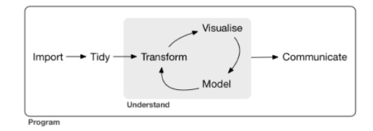
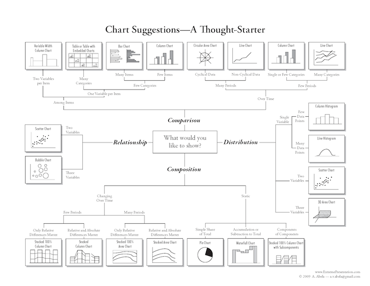
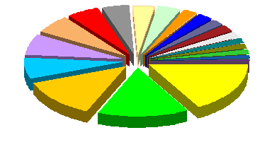
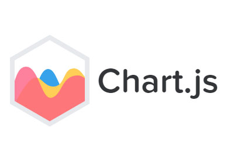
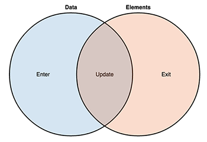
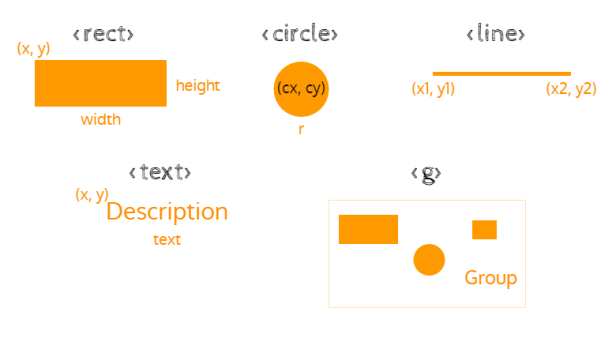
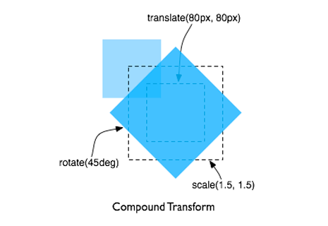
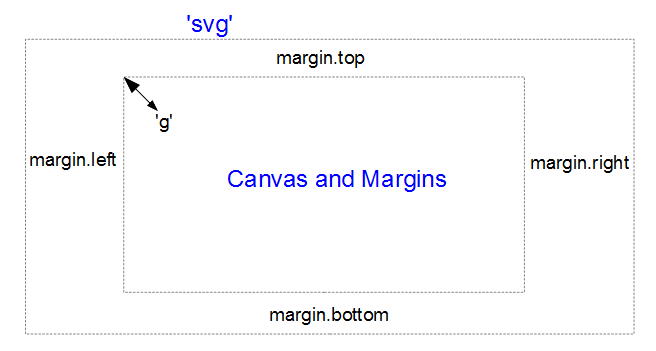
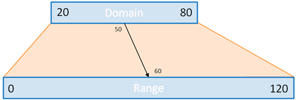

name: inverse
layout: true
class: center, middle, inverse
---
# Visualización de datos con D3.js
Luz Frias
.footnote[Ver en [GitHub](https://github.com/koldLight/intro-d3-talk)]
---
layout: false
class: large
## ¡Hola!
Soy Luz Frias

- Mitad desarrolladora, mitad científica de datos

- Freelance

- Contacto:

    - Correo: luzfrias@gmail.com
    - GitHub: [koldLight](https://github.com/koldLight)
    - Twitter: [koldLight](https://twitter.com/koldLight)
---
template: inverse
## ¿Y vosotras?
---
class: large
## Visualización de datos

Es la expresión mediante imágenes de información cuantitativa, espacial o de relaciones


---
template: inverse
## Clave en exploración y comunicación de datos
---
## Unos términos muy de moda
.left-column[
  ## Data science
]
.right-column[
  Conjunto de técnicas cuyo objetivo es extraer conocimiento de los datos.

- Es inter-disciplinar

- Las herramientas más populares son R y Python


]
---
## Unos términos muy de moda
.left-column[
  ## Data science
  ## Machine Learning
]
.right-column[
  Creación de programas capaces de generalizar comportamientos a partir de ejemplos vistos

- En general, dos posibles objetivos:

    - Predecir el futuro
    - Entender cómo se produce el comportamiento

- Fuerte uso de matemáticas: estadística y algoritmia


]
---
## Unos términos muy de moda
.left-column[
  ## Data science
  ## Machine Learning
]
.right-column[
  Creación de programas capaces de generalizar comportamientos a partir de ejemplos vistos

- En general, dos posibles objetivos:

    - Predecir el futuro
    - Entender cómo se produce el comportamiento

- Fuerte uso de matemáticas: estadística y algoritmia


]
---
## Unos términos muy de moda
.left-column[
  ## Data science
  ## Machine Learning
  ## Big data
]
.right-column[
  Técnicas para tratar grandes conjuntos de datos

- Cambios en la forma de capturar, almacenar y analizar los datos

- Cambios también en la forma de plantear los problemas

- Perfil con conocimientos en sistemas distribuidos y programación


]
---
template: inverse
## Conceptos generales de visualización de datos
---
## El tipo de gráfico

---
## Evita la distorsión
El objetivo de un gráfico es comunicar de manera clara



---
## Los colores
La escala de colores debe reflejar la naturaleza de los datos:

- Secuencial: refleja progresivamente las diferencias entre poco y mucho. P.e. los ingresos mensuales medios por barrio.
- Divergente: tiene naturaleza secuencial, pero interesa destacar los extremos y el punto medio. P.e. el mapa de intención de voto demócrata vs republicano en EEUU.
- Cualitativa: refleja categorías sin orden. P.e. hombres vs mujeres.

Herramienta para elegir los colores: [colorbrewer](http://colorbrewer2.org/)


---
## Ejes y escalas
.left-column[
  ### Escala
]
.right-column[
  Depende de la naturaleza de la comparación.

  Por defecto, escala lineal. Puede ser útil también la logarítmica

  
]
---
## Ejes y escalas
.left-column[
  ### Naturaleza de la comparación
  ### El cero
]
.right-column[
  Depende de si la comparación es absoluta o relativa

  
]
---
## Ejes y escalas
.left-column[
  ### Naturaleza de la comparación
  ### El cero
  ### Varios ejes
]
.right-column[
  Intenta no mezclar dos ejes en la misma dirección. Si lo haces, que quede claro

  
]
---
class: large
## Ejemplos de buenas visualizaciones

- [Servicio militar EEUU](http://www.npr.org/2011/07/03/137536111/by-the-numbers-todays-military)
- [Cartograma elecciones UK](http://www.viewsoftheworld.net/wp-content/uploads/2015/05/ukelection2015_mapviews.jpg)
- [Animación envejecimiento población](http://www.pewresearch.org/files/2014/04/847889448.gif)
- [Elecciones catalanas](http://www.huffingtonpost.es/2015/09/28/elecciones-catalanas-twitter_n_8206438.html)
---
class: large
## Ejercicio: malas visualizaciones
Justifica el por qué son malas:

- [Categorías empresas](https://www.datanalytics.com/2011/11/08/bump-charts-para-comparar-graficamente-proporciones-entre-periodos/)
- [IEH](https://www.datanalytics.com/2015/04/23/valores-diferentes/)
- [Ejes](https://www.datanalytics.com/2013/09/05/donde-deberian-comenzar-los-ejes/)
- [CSIC](https://www.datanalytics.com/2013/08/27/el-pomelazo-del-csic/)
- [Público y privado](https://www.datanalytics.com/2011/01/31/un-grafico-enganabobos/)
---
template: inverse
## Librerías para pintar gráficos
---
## Librerías
Criterios para escoger una:
- Licencia. ¿Es open source? ¿Debo pagar para proyectos comerciales?
- Evolución y mantenimiento. Una forma rápida: mira estrellas y última actualización en GitHub
- Productividad
- Flexibilidad
---
## Librerías
.left-column[
  ### D3
]
.right-column[
  Pros:

- Gratis
- Muy potente, flexible
- Utilidades para tratar datos (filtrar, agrupar, ...)

Cons:

- Difícil de dominar
- Código extenso


]
---
## Librerías
.left-column[
  ### D3
  ### Highcharts
]
.right-column[
  Pros:

- Muchos tipos de gráficos disponibles
- Productivo

Cons:

- De pago, si es proyecto comercial


]
---
## Librerías
.left-column[
  ### D3
  ### Highcharts
  ### Chart.js
]
.right-column[
  Pros:

- Gratis
- Productivo

Cons:

- Pocos tipos de gráficos disponibles


]
---
template: inverse
## D3.js
---
## Un ejemplo sencillo

[`01_ejemplo_barras.html`](./codigo/01_ejemplo_barras.html)

Selección del contenedor:

```javascript
d3.select(".grafico")
```

Join de datos con elementos:

```javascript
  .selectAll("div")
  .data(data)
```

Del resultado del join, nos quedamos con los elementos nuevos. E indicamos que cada elemento nuevo debe pintar un div:

```javascript
  .enter().append("div")
```

Esos div, deben tener una determinada anchura y texto, calculados en función al dato que representan:

```javascript
  .style("width", d => d * 10 + "px")
  .text(d => d + ' €');
```
---
## Conceptos
.left-column[
  ### Select
]
.right-column[
- `select("rect")` para seleccionar un elemento y `selectAll("rect")` para seleccionarlos a todos

- Funciona con selectores CSS

- Lenguaje muy declarativo: qué quieres hacer en lugar de cómo quieres hacerlo
]
---
## Conceptos
.left-column[
  ### Select
  ### Join
]

.right-column[
- Join relaciona los datos con los elementos visuales

- Tres posibles estados del join:

    - enter: elementos nuevos, que no estaban
    - update: elementos que persisten, estaban y siguen ahí
    - exit: elementos antiguos, estaban pero ya no

- Con `append("circle")` creamos elementos y con `remove("circle")` los eliminamos

]
---
## Conceptos
.left-column[
  ### Select
  ### Join
  ### Modificaciones
]

.right-column[
- Podemos modificar los elementos visuales, con:

    - style: el estilo. P.e. `style("fill", "blue")`
    - attr: un atributo. P.e. `attr("width", "40px")`
]
---
## SVG
.left-column[
  ### Elementos SVG
]
.right-column[
Para aprovechar la potencia de pintado de D3, utilizaremos elementos SVG


]
---
## SVG
.left-column[
  ### Elementos SVG
  ### Transformaciones
]
.right-column[
- `translate("80px", "80px")` para desplazar
- `rotate("45deg")` para girar
- `scale(1.5, 1.5)` para escalar


]

---
## SVG
.left-column[
  ### Elementos SVG
  ### Transformaciones
  ### Márgenes del canvas
]
.right-column[
Es habitual tener un canvas SVG y pintar respetando los márgenes establecidos


]
---
## SVG

[`02_ejemplo_svg.html`](./codigo/02_ejemplo_svg.html)

Creación del canvas con el tamaño especificado:

```javascript
const svg = d3.select('#grafico').append('svg')
              .attr('width', width + margin.left + margin.right)
              .attr('height', height + margin.top + margin.bottom)
```

Y dentro, creamos un grupo más pequeño (restando y desplazando los márgenes):

```javascript
      .append('g')
      .attr('transform', 'translate(' + margin.left + ',' + margin.top + ')');
```

Ahora puedo pintar dentro con elementos SVG, p.e. círculos:

```javascript
svg.selectAll('circle')
    .data(data)
    .enter()
    .append('circle')
    .attr('cx', (d, i) => (i + 1) * 100)
    .attr('cy', d => height - d)
    .attr('r', d => d)
    .style('fill', 'orange');
```
---
## Ejercicio

Modifica el código anterior (sobre un fichero nuevo) para que:

- En lugar de círculos, se pinten rectángulos
- La posición x: sea para el primer elemento 10, para el segundo 20, luego 30, ... etc
- La posición y: sea el borde inferior del canvas, respetando el margen
- La anchura: 8px
- La altura: el dato a representar

¿A qué se empieza a parecer el resultado?
---
## Escalas

Hasta ahora estábamos transformando los datos "a mano" para visualizarlos en el gráfico. Para pasar de nuestra magnitud al canvas del gráfico, podemos utilizar las escalas.
---
## Escalas
### Escala lineal



```javascript
const scale = d3.scaleLinear()
                .domain([20, 80])
                .range([0, 120]);
scale(50);  // resultado: 60
```

Otro ejemplo, cogiendo la escala desde el 0 hasta el máximo de los datos

```javascript
const scale = d3.scaleLinear()
                .domain([0, d3.max(data, d => d.value)])
                .range([120, 0]);  // ¿por qué primero 120, luego 0?
```
---
## Escalas

### Escala de bandas

La escala de bandas es una escala ordinal que mapea valores discretos a una escala contínua. Útil para gráficos de barras.


```javascript
const scale = d3.scaleBand()
                .domain(['L', 'M', 'X', 'J', 'V', 'S', 'D'])
                .range([0, 350])
scale('J');  // resultado: 150
```

Otro ejemplo, cogiendo como dominio un atributo de los datos con `map`:

```javascript
const scale = d3.scaleBand()
                .domain(data.map(d => d.dia_semana))
                .range([0, 350]);
```
---
## Ejes

Son los componentes visuales asociados a una escala. Se pueden personalizar a gran nivel de detalle. P.e. cuántos y dónde ponemos los ticks.

- Para crearlo, usamos `axisLeft`, `axisBottom`, `axisRight`, `axisTop`.
- Es posible que haya que trasladarlo hasta su posición con `translate`.
- Para pintarlo, `call()`

```javascript
const xAxis = d3.axisBottom(xScale);
svg.append("g")
   .attr('transform', 'translate(0,' + height + ')')
   .call(xAxis);
```
---
## Entrada de datos

Los datos pueden estar almacenados en un archivo o disponibles a través de una API HTTP, en formato JSON o CSV. Para leerlos:

```javascript
d3.json('ruta', (error, data) => {
  if (error) throw error;

  // resto del código usando data ...
})
```

```javascript
d3.csv('ruta', (error, data) => {
  if (error) throw error;

  // si tenemos que transformar a numérico
  data.forEach(d => d.contador = +d.contador);
})
```
---
## Ejercicio

Partiendo del [`03_ejercicio_barras.html`](./codigo/03_ejercicio_barras.html), el objetivo es crear un gráfico de barras para los resultados de las elecciones generales del 2016. En el eje x tendremos cada uno de los partidos, y en el y, la cantidad de escaños obtenidos. Vamos a hacerlo poco a poco:

- Lee los datos de `datos/elecciones.csv`, convirtiendo a numéricas las columnas que debas. Comprueba imprimiendo por consola el resultado de la lectura
- Crea la escala `xScale` para los datos en el eje x
- Crea la escala `yScale` para los datos en el eje y
- Crea las barras. La anchura debe ser 50px
- Pinta los ejes x e y

---
## Ejercicio: ahora con chart.js

Partiendo del [`04_ejercicio_chartjs.html`](./codigo/04_ejercicio_chartjs.html), busca en la documentación de Chart.js cómo generar un gráfico simple de barras y píntalo. Los datos están cargados en la variable `data`.

---
template: inverse
## Conclusiones
